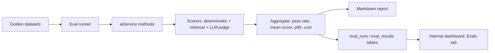

# AI Evals & Observability + Portfolio Upgrades

## Recommended approach (since you were unsure)

Build a **code-first eval harness committed to the repo** and **extend the existing custom observability**, instead of adopting a managed platform. This deepens the system you already built (`ai_usage_events`, the internal dashboard, the "keep a custom memory system" ADR), which reads better in a portfolio than wiring up a vendor SDK. Judge model: **Claude Opus via your AI Gateway** for subjective grading; deterministic checks everywhere else. A short "Alternatives considered" note in the eval README will cite Langfuse/Braintrust/Promptfoo so reviewers see you know the landscape.

## Critical fix to unblock everything

Runtime gates all AI on `AI_GATEWAY_API_KEY`, but it's undocumented and `env.ts` validates the unused `OPENAI_API_KEY` (see audit). Before evals can run against real models:

- Add `AI_GATEWAY_API_KEY` to `apps/api/src/lib/env.ts` and `.env.example`, and fix the misleading "OpenAI API key not configured" message in [apps/api/src/lib/ai/ai.service.ts](apps/api/src/lib/ai/ai.service.ts) (lines 345-356).

---

## Part A — Eval harness (flagship)

New folder `apps/api/src/evals/` with a small runner, datasets, and scorers. Eval files use a `.eval.ts` suffix and a **separate Vitest project config** so they never run in normal `pnpm test` (they cost money / hit the gateway). Run via a new `pnpm eval` script.

### A1. Refactor AI service for testability

Extract the prompt-building strings from [ai.service.ts](apps/api/src/lib/ai/ai.service.ts) (the `prompt = [...]` arrays at lines 438-451 and 549-561) into pure exported `buildXPrompt()` functions, and allow an optional `model` override param on each method. This lets evals (a) snapshot/assert on prompts deterministically and (b) A/B different models without touching call sites.

### A2. Golden datasets (committed JSON/JSONL)

Per feature under `apps/api/src/evals/datasets/`:

- `title.jsonl` — entry text -> ideal title traits (length, no quotes, topical keywords).
- `memory-extraction.jsonl` — entry text -> expected categories + must/must-not facts (groundedness labels).
- `prompts.jsonl` — memory sets + focusCategory -> expected anchoring behavior.
- `retrieval.jsonl` — query + labeled relevant memory IDs (for recall@k / MRR).

### A3. Scorers (`apps/api/src/evals/scorers/`)

- **Deterministic** (free, fast): JSON/schema validity (reuse the Zod schemas already in `ai.service.ts`), title length <=50 and no quotes, valid memory categories, confidence in [0,1], min/max prompt counts, at-least-one-anchor rule.
- **Retrieval metrics**: `recall@k`, `MRR`, mean cosine separation over `memory_embeddings`.
- **LLM-as-judge** (Claude Opus via gateway): title relevance (1-5), memory faithfulness/groundedness vs source entry (hallucination check), prompt usefulness + anchoring quality. Judges return structured scores via `Output.object`.

### A4. Runner + reporting (`apps/api/src/evals/runner.ts`)

Iterates datasets, calls the real `aiService` methods, applies scorers, aggregates pass-rate / mean-score / p95 latency / cost per feature, and writes:

- A human-readable `evals/reports/<timestamp>.md` summary.
- Rows into a new `eval_runs` + `eval_results` table (see B2) for trend tracking in the dashboard.

---

## Part B — Observability upgrade (extend, don't replace)

Build on [observability.service.ts](apps/api/src/features/observability/observability.service.ts) and [observability.table.ts](apps/api/src/features/observability/observability.table.ts).

### B1. Capture traces (prompt/response)

Add an `ai_trace_spans` table (or nullable `promptText`/`responseText`/`finishReason` columns) linked to `ai_usage_events`. Gated by an env flag (default off in prod) with PII-aware redaction, so it doubles as a privacy-conscious design talking point. Wire capture into the four methods in `ai.service.ts`.

### B2. Eval result storage

New `eval_runs` (id, gitSha, model, startedAt) and `eval_results` (runId, feature, datasetCase, scorer, score, passed, latencyMs, costUsd) tables in the observability feature, plus a Drizzle migration (follow the `db:generate` + journal rules in CLAUDE.md).

### B3. Richer metrics

In `getAiOverview`: replace `avg(latency)` with **p50/p95**, add **estimated cost** (token x price map), **fallback rate**, and per-feature error rate.

### B4. Dashboard

Extend [InternalDashboardPage.tsx](apps/web/src/pages/InternalDashboardPage.tsx): add an **Evals tab** (latest run, pass-rate per feature, score trend), cost-over-time, p95 latency. Also fix the known gap where `memory_embedding` is missing from the frontend feature filter (`apps/web/src/components/internal/types.ts`, `api.ts`).

---

## Part C — CI

No `.github/workflows/` exists yet. Add:

- `ci.yml` — on PR: `pnpm install`, `pnpm type-check`, `pnpm test` (unit tests only; evals excluded).
- `evals.yml` — manual (`workflow_dispatch`) + nightly schedule: run `pnpm eval`, upload the markdown report as an artifact, and fail if pass-rate regresses below a threshold. Keeps paid eval runs off every PR.

---

## Part D — Other portfolio boosters (prioritized menu)

Recommended to include now (high impact, low scope):

- **CI eval gates** (Part C) — visible engineering rigor.
- **Cost + token tracking** in the dashboard (Part B3) — "AI cost awareness" is a strong signal.
- **A polished case-study README** for the AI system: architecture diagram, eval methodology, sample eval report, screenshots. This is what employers actually click on.

Strong follow-ups (own phase each):

- **Durable queue**: replace the inline "queue" in [memory-queue.ts](apps/api/src/lib/queue/memory-queue.ts) / [memory-pipeline.service.ts](apps/api/src/features/memories/memory-pipeline.service.ts) with **pg-boss** (uses existing Postgres, no new infra) so jobs survive restarts — demonstrates distributed-systems maturity. Your `queue_job_events` schema already models retries/dead-letter.
- **Prompt versioning / A/B experiments** wired into the eval harness (compare prompt v1 vs v2, or gpt-4o-mini vs gpt-4o, on the golden set).
- **RAG quality pass**: add reranking + report `recall@k`/`MRR` trends.
- **Per-user rate limiting / budgets** on AI endpoints.
- **Streaming** title/prompt generation for UX polish.
- **Guardrails**: moderation + PII redaction on stored traces.

Optional "awareness" add-on: an **OpenTelemetry exporter** or a thin Langfuse adapter behind the existing `recordAiUsage` interface, so the custom layer can also feed an industry-standard tool.

---

## Suggested phasing

1. Critical fix (env/key) + AI service refactor for testability.
2. Eval datasets + deterministic & retrieval scorers + runner + markdown report.
3. LLM-as-judge scorers (Claude Opus).
4. Observability: trace capture, eval tables, p95/cost metrics, dashboard Evals tab.
5. CI workflows + case-study README.
6. (Stretch) durable queue, prompt A/B, rate limiting.
