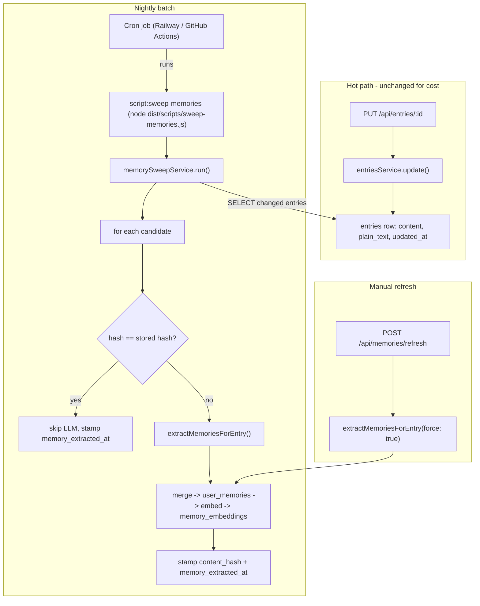

# Plan: Memory Extraction Cost Optimization — Nightly Batch Sweep

**Status:** Ready for implementation
**Supersedes:** the debounce/poll-loop approach in [`memory_extraction_cost_optimization_handoff.md`](.cursor/plans/memory_extraction_cost_optimization_handoff.md)
**Goal:** Cut AI spend on memory extraction by ~10x by collapsing 5-15 per-session LLM extractions into ~1 per entry per day.

**Delivery:** Ship as a **single PR**. **Retire the legacy queue machinery in this PR** (do not leave it as dead code) — see Phase B.

---

## Decision summary

We explored several mechanisms (in-memory debounce, DB-backed debounce + poll loop, client-driven "on done", periodic sweep, throttle, content-hash skip). The deciding constraint:

> **Freshness requirement: hours of lag is acceptable.** Memories are long-term context, not live co-writing signal.

That relaxed requirement removes the need to detect "user is done" within seconds, which deletes the most complex parts of the earlier design (per-save timers, due-time stamping, claim-by-due-time logic). The chosen approach:

- **Stop extracting on every autosave.** Remove the per-save `publishEntryChangedJob` calls.
- **A nightly batch sweep** finds entries whose content changed since their last extraction and extracts them once.
- **A content hash** skips entries whose `plain_text` did not meaningfully change (e.g. a title update bumped `updated_at`).
- **A cron job** triggers the sweep by running a repo script (`pnpm script:sweep-memories`) — no HTTP endpoint, no secret, no auth surface.
- **Manual refresh** runs extraction immediately for the latest entry, bypassing the hash skip (`force`).

### Explicitly dropped (decided during discussion)

| Item | Reason |
|------|--------|
| In-memory `setTimeout` debounce | Lost on every deploy/restart (no SIGTERM handler) |
| `next_extraction_due_at` column + per-save stamping | Not needed once we sweep instead of debounce |
| In-process poll loop | Replaced by a cron-run script |
| HTTP cron endpoint + `CRON_SECRET` | Replaced by running a repo script directly under cron — no endpoint to protect |
| Rule B (min words) | Short entries are cheap and can be high-signal |
| Rule C (immaterial < 10% word delta) | Same-length rewrites would be silently skipped |
| Frontend flush-on-leave | Only mattered for sub-minute freshness, which we don't need |
| pg-boss / durable queue | Overkill for a nightly batch; revisit if real-time extraction is ever needed |
| Legacy queue machinery (`publishEntryChangedJob`, `runEntryChangedJobWithRetries`, `buildMemoryProcessKey`, `MemoryEntryChangedJob`, `MEMORY_JOB_VERSION`) | **Retired in this PR.** The hash + `memory_extracted_at` columns now provide idempotency; the sweep + force path replace publish. Removing it (rather than leaving dead code) keeps the surface honest. `memory_events` audit writes are kept. |

---

## Architecture



---

## Phase A — Schema

Add two nullable columns to [`apps/api/src/features/entries/entries.table.ts`](apps/api/src/features/entries/entries.table.ts):

```ts
memoryExtractionContentHash: text('memory_extraction_content_hash'),
memoryExtractedAt: timestamp('memory_extracted_at'),
```

- From `apps/api`: `pnpm db:generate` -> review SQL -> `pnpm db:migrate`.
- Commit the `.sql`, its snapshot, and the updated `_journal.json` together (per `CLAUDE.md` migration rules; baseline is `0004`).
- Optional index to make the nightly candidate query cheap: `CREATE INDEX ON entries (memory_extracted_at, updated_at)` (or a partial index on `plain_text <> ''`). Include it in the generated migration if Drizzle does not add one.

> **Migration ordering:** keep the **column add** (Phase A) and the **enum value add** (`content_unchanged`, see Observability) as **two separate generated migrations**. Postgres `ALTER TYPE ... ADD VALUE` cannot run in the same transaction as other DDL, so isolating it avoids a `drizzle-kit` transaction failure on a fresh DB.

---

## Phase B — Reusable extraction + helpers

### `hashPlainText` helper

Add to [`apps/api/src/features/memories/memory-pipeline.helpers.ts`](apps/api/src/features/memories/memory-pipeline.helpers.ts):

```ts
import { createHash } from 'node:crypto';

export function hashPlainText(plainText: string): string {
  return createHash('sha256').update(plainText.trim()).digest('hex');
}
```

### Refactor extraction into a reusable, entry-scoped function

In [`apps/api/src/features/memories/memory-pipeline.service.ts`](apps/api/src/features/memories/memory-pipeline.service.ts), factor the core of `processEntryChangedJob` (load memories -> extract -> merge -> embed -> persist -> record events) into:

```ts
async function extractMemoriesForEntry(
  entry: Entry,
  opts: { force?: boolean; source: 'sweep' | 'manual' },
): Promise<{ outcome: 'extracted' | 'content_unchanged' | 'no_entry_text' | 'no_candidates' }>
```

Behavior:
1. If `!entry.plainText?.trim()` -> record `no_entry_text`, return.
2. Compute `hash = hashPlainText(entry.plainText)`.
3. If `!opts.force && hash === entry.memoryExtractionContentHash` -> record `skipped / content_unchanged`, set `memory_extracted_at = now()` (so it is not re-scanned), return.
4. Run existing extraction + merge + embedding pipeline (unchanged logic).
5. On success: `UPDATE entries SET memory_extraction_content_hash = hash, memory_extracted_at = now()`.
6. Record `queue_job_events` outcomes as today, plus the new `content_unchanged` outcome.

This function is called by both the sweep (per entry) and manual refresh (with `force: true`).

**Audit-key synthesis (required by the retirement).** Today every `memory_events` / `queue_job_events` row is keyed by `buildMemoryProcessKey(entryId, entryUpdatedAt)`. With the job gone, `extractMemoriesForEntry` must synthesize its own stable key for those audit writes — use `sweep:${entry.id}:${hash}` (deterministic; also naturally dedups a re-run on identical content). Generate a `jobId` with `randomUUID()` for the `queue_job_events` rows. The old `entryUpdatedAt`-based idempotency *check* (the `memory_events ->> 'idempotencyKey'` lookup) is **removed** — the content hash now guards re-extraction.

### Remove the per-save trigger

In [`apps/api/src/features/entries/entries.service.ts`](apps/api/src/features/entries/entries.service.ts), remove the two `void memoriesPipelineService.publishEntryChangedJob({...})` calls (in `createOrGetByDate` insert branch and in `update`) and drop the now-unused `memoriesPipelineService` import. Saves no longer trigger extraction.

### Retire the legacy queue machinery (this PR)

The hash + `memory_extracted_at` columns now provide idempotency, so the job/publish/retry layer is dead. Remove it in this PR rather than leaving dead code:

- Delete [`apps/api/src/lib/queue/memory-queue.ts`](apps/api/src/lib/queue/memory-queue.ts) (`MEMORY_JOB_VERSION`, `MemoryEntryChangedJob`, `buildMemoryProcessKey`) — and the `lib/queue/` dir if nothing else lives there.
- In `memory-pipeline.service.ts`: remove `publishEntryChangedJob`, `runEntryChangedJobWithRetries`, the `processEntryChangedJob` job-payload wrapper, and the `MemoryJobValidationError` payload-validation path. The valuable inner logic (load memories -> extract -> merge -> embed -> persist -> `memory_events`) moves into `extractMemoriesForEntry`.
- Keep the retry-with-backoff behavior by wrapping the per-entry call (the sweep and manual refresh can both reuse a small `runWithRetries(fn)` helper, or the sweep can simply count+continue and rely on the next nightly run). Keep `memory_events` audit writes and `observabilityService.recordQueueJobEvent`/`recordAiUsage`.
- Update/delete any imports of the removed symbols (`memories.service.ts`, `entries.service.ts`, tests). After this, the only public export of the pipeline module is `extractMemoriesForEntry` (used by the sweep service and `memories.service.ts`).

---

## Phase C — Nightly sweep service + script

### Sweep service

New file `apps/api/src/features/memories/memory-sweep.service.ts`:

```ts
export const memorySweepService = {
  async run(opts?: { limit?: number }): Promise<{
    scanned: number; extracted: number; skipped: number; errors: number;
  }> {
    const limit = opts?.limit ?? env.MEMORY_SWEEP_BATCH_LIMIT;

    const candidates = await db
      .select()
      .from(entries)
      .where(
        and(
          ne(entries.plainText, ''),
          or(
            isNull(entries.memoryExtractedAt),
            gt(entries.updatedAt, entries.memoryExtractedAt),
          ),
        ),
      )
      .orderBy(sql`${entries.memoryExtractedAt} asc nulls first`)
      .limit(limit);

    // process SEQUENTIALLY (await each extractMemoriesForEntry in turn) to be gentle on the AI gateway
    // tally outcomes, swallow per-entry errors (log + count), continue
  },
};
```

Notes:
- `ne`/`or`/`isNull`/`gt` from `drizzle-orm`; use a raw `sql` fragment for `asc nulls first` ordering so **never-extracted entries (NULL) are processed first**, not last (Postgres sorts NULLs last under a plain `asc`).
- **Sequential processing only** for v1 (no `p-limit` dependency). A nightly batch has no latency pressure; sequential is simplest and safest for the gateway. Revisit concurrency only if batch runtime becomes a problem.
- Per-entry errors must not abort the whole sweep — catch, count into `errors`, continue.
- Keep `run()` infra-agnostic (no Express, no req/res) so it is callable from a script, a test, or (later) anything else.

### Sweep script

New file `apps/api/src/scripts/sweep-memories.ts`, following the existing script pattern (see [`backfill-memory-embeddings.ts`](apps/api/src/scripts/backfill-memory-embeddings.ts)): `import 'dotenv/config'`, `@/` alias imports, a `main()` that logs a summary, and `main().catch(... process.exit(1))`.

```ts
import 'dotenv/config';
import { memorySweepService } from '@/features/memories/memory-sweep.service.js';

// Optional args (same lightweight parser style as other scripts):
//   --limit <number>   override MEMORY_SWEEP_BATCH_LIMIT
//   --run <true|false> dry-run support (default true for cron; false = count only)
async function main() {
  const startedAt = Date.now();
  const summary = await memorySweepService.run(/* { limit, dryRun } */);
  console.log(
    `[sweep-memories] done in ${Date.now() - startedAt}ms`,
    summary, // { scanned, extracted, skipped, errors }
  );
}

main()
  .then(() => process.exit(0))
  .catch((error) => {
    console.error('[sweep-memories] failed:', error);
    process.exit(1);
  });
```

- Add to [`apps/api/package.json`](apps/api/package.json) scripts: `"script:sweep-memories": "tsx src/scripts/sweep-memories.ts"` (matches the existing `script:*` entries for local/dev runs).
- The production build (`tsc && tsc-alias`) compiles `src/scripts/*.ts` into `dist/scripts/*.js`, so the cron can run `node dist/scripts/sweep-memories.js` without `tsx` (which is a devDependency, not present in prod).
- `process.exit(0)` on success so the cron run terminates cleanly (the DB client otherwise keeps the event loop alive).
- A non-zero exit on failure lets the scheduler surface/alert on failed runs.

### Manual refresh -> force

In [`apps/api/src/features/memories/memories.service.ts`](apps/api/src/features/memories/memories.service.ts), change `enqueueRefresh` to call `extractMemoriesForEntry(latestEntry, { force: true, source: 'manual' })` instead of `publishEntryChangedJob`. It must bypass the hash skip (`force: true`).

- Keep the current **fire-and-forget** shape so the route still returns its accepted/202-style response immediately rather than blocking on the LLM call: `void extractMemoriesForEntry(latestEntry, { force: true, source: 'manual' }).catch((e) => console.error(...))` (optionally wrapped by the shared `runWithRetries` helper). The returned `{ accepted: true, ... }` payload is unchanged.

---

## Phase D — Config + env

Add to [`apps/api/src/config/env.ts`](apps/api/src/config/env.ts):

```ts
MEMORY_SWEEP_BATCH_LIMIT: z.coerce.number().default(500),
```

Document in [`apps/api/.env.example`](apps/api/.env.example):

```
# Nightly memory extraction sweep (run via: pnpm --filter @starter/api script:sweep-memories)
MEMORY_SWEEP_BATCH_LIMIT=500
```

No `CRON_SECRET` is needed — the sweep is a script, not an exposed endpoint. The script reuses the same `DATABASE_URL` / `AI_GATEWAY_API_KEY` the API already uses.

---

## Phase E — Scheduler wiring (cron runs the script)

The cron job's only responsibility is to run the script on a schedule. Suggested schedule: `0 8 * * *` UTC (off-peak). The exact time/scheduler is a deployment detail, not code. Pick one:

- **Railway cron (recommended).** Add a cron job in the same project that runs the compiled script with the production env vars already present:
  - Command: `node dist/scripts/sweep-memories.js` (after the standard build), or `pnpm --filter @starter/api script:sweep-memories` if `tsx` is available in that image.
  - Schedule: `0 8 * * *`.
  - It runs in the Railway environment, so `DATABASE_URL` and `AI_GATEWAY_API_KEY` are inherited — nothing extra to configure.
- **GitHub Actions scheduled workflow** (alternative): a `schedule: cron` job that checks out the repo, installs deps, and runs `pnpm --filter @starter/api script:sweep-memories`. This requires giving CI access to the production `DATABASE_URL` (and `AI_GATEWAY_API_KEY`) as repo secrets, so it reaches the prod DB from outside Railway — workable but a wider secret blast radius than Railway cron.

Because the script connects directly to the DB and does idempotent, hash-guarded work, it is safe to run manually any time (e.g. `pnpm --filter @starter/api script:sweep-memories`) for testing or a one-off catch-up.

---

## Observability

- Reuse `observabilityService.recordQueueJobEvent` / `recordAiUsage`. Keep `jobType: 'memory_entry_changed'` (the `queueJobTypeEnum` value is unchanged; no need to add a sweep-specific type).
- Extend `queueJobOutcomeEnum` in [`apps/api/src/features/observability/observability.table.ts`](apps/api/src/features/observability/observability.table.ts) with `content_unchanged`; reuse the existing `skipped` status for it (no new status value needed). This is its **own** enum-altering migration, generated separately from the Phase A column migration (see the Phase A ordering note).
- The script logs a summary (`{ scanned, extracted, skipped, errors }`) so cron run logs are inspectable.
- Verify in the `/internal` dashboard that nightly runs produce one `memory_extraction` `ai_usage_events` row per genuinely-changed entry and `content_unchanged` skips otherwise.

---

## Testing

- **Helper:** `hashPlainText` is stable, trims whitespace, differs on content change.
- **`extractMemoriesForEntry` (mock `aiService` + db):**
  - changed content -> extracts, stamps hash + `memory_extracted_at`.
  - unchanged hash, not forced -> `content_unchanged`, no LLM call, still stamps `memory_extracted_at`.
  - `force: true` on unchanged hash -> extracts anyway.
  - empty `plainText` -> `no_entry_text`.
- **`memorySweepService.run` (mock db):** selects only changed/never-extracted entries; one extraction per changed entry; per-entry error does not abort the batch; respects `limit`.
- **Script:** `main()` runs `memorySweepService.run()` and logs the summary; success exits 0, failure exits non-zero. (Keep heavy logic in the service so it is unit-testable without spawning the script.)
- **Retirement cleanup:** delete/relocate any tests that import the removed queue symbols (`memory-queue.ts`, `publishEntryChangedJob`, `buildMemoryProcessKey`, `MemoryEntryChangedJob`). The existing `memory-pipeline.service.test.ts` only exercises helpers, so it survives unchanged; no current test asserts `publishEntryChangedJob` is called.
- Run `pnpm test` and `pnpm type-check`.

---

## Rollout / verification

1. Apply migrations on a disposable Neon branch first (per `CLAUDE.md`), then primary.
2. Run the script manually against the deployed DB (`pnpm --filter @starter/api script:sweep-memories`) -> confirm summary + AI usage rows.
3. Confirm typing in the editor produces **zero** `memory_extraction` events (per-save trigger removed).
4. Confirm `POST /api/memories/refresh` still forces an extraction.
5. Configure the Railway cron job (`node dist/scripts/sweep-memories.js`, `0 8 * * *`); confirm the nightly run in logs.

---

## Acceptance criteria

1. Editing entries no longer triggers any `memory_extraction` AI usage events.
2. The nightly sweep extracts exactly once per entry whose `plain_text` changed since last extraction; unchanged entries record `content_unchanged` with no LLM call.
3. Running `script:sweep-memories` performs the sweep, logs a summary, and exits cleanly (0 on success, non-zero on failure); it is safe to run repeatedly.
4. `POST /api/memories/refresh` always extracts (force path).
5. Migrations apply cleanly on a fresh DB from the `0004` baseline.
6. No regression: memories are still created/merged/embedded for changed entries.

---

## Risks and mitigations

| Risk | Mitigation |
|------|------------|
| Nightly burst of LLM calls across all users | Sequential / small-concurrency processing + `MEMORY_SWEEP_BATCH_LIMIT`; off-peak schedule |
| Memories stale up to ~24h | Accepted (freshness requirement is "hours"); manual refresh available for force |
| No exposed endpoint to attack | Sweep runs as a script inside the deploy environment; no public surface, no secret to leak |
| Script left running / overlapping runs | `process.exit` on completion; nightly cadence makes overlap unlikely; runs are idempotent (hash-guarded) so an overlap is harmless |
| Retiring queue machinery breaks imports/tests | No current test asserts `publishEntryChangedJob`; fix any broken imports of removed symbols during the refactor and rely on `pnpm type-check` to surface stragglers |
| Future need for real-time extraction | `extractMemoriesForEntry(force)` is the foothold; add an on-demand trigger then |
```
