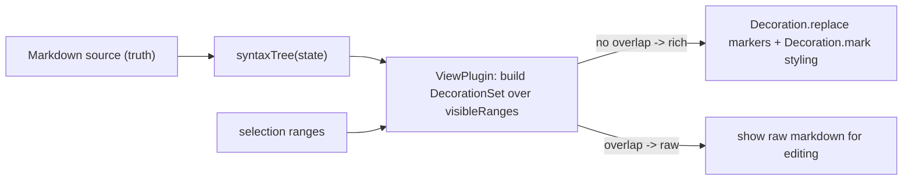

# Obsidian-style Live Preview editor

## Goal

Turn [apps/web/src/components/editor/MarkdownEditor.tsx](apps/web/src/components/editor/MarkdownEditor.tsx) into a single-surface live-preview editor:

- No formatting toolbar, no Edit/Preview toggle.
- Markdown is styled inline (bold is bold, headings are big, lists get bullets, links are clickable text).
- Raw syntax markers (`**`, `#`, `[..](..)`, `` ` ``) are hidden on inactive lines and reappear when the cursor/selection enters that element.
- The document the editor stores stays plain markdown -- save/load is unchanged.

## Approach

Obsidian's Live Preview is implemented with CodeMirror 6 decorations driven by the Lezer markdown syntax tree (confirmed via Obsidian's own plugin docs). We already have the full stack installed (`@uiw/react-codemirror`, `@codemirror/lang-markdown`, `@codemirror/view`, `@codemirror/language-data`), so we build a custom decoration extension rather than adding a heavy/early-stage dependency. This keeps the OKLCH theme and bundle under our control.

## New file: live-preview extension

Create `apps/web/src/components/editor/live-preview.ts` exporting `livePreview()` returning a CM6 extension.

- A `ViewPlugin.fromClass` that holds a `DecorationSet`, rebuilds in `update()` on `docChanged || viewportChanged || selectionSet`, and provides decorations via `{ decorations: v => v.decorations }`.
- A `buildDecorations(view)` helper that iterates `syntaxTree(state)` over `view.visibleRanges` (pattern from Obsidian docs / `nathanlesage` gist).
- For each node, compute whether any selection range overlaps the node range: `selections.some(([f,t]) => !(t <= node.from || f >= node.to))`. If it overlaps, leave raw (skip hiding). Otherwise apply rich decorations.
- Use a `RangeSetBuilder<Decoration>` and add ranges in ascending order (sort/iterate carefully to avoid "out of order" errors).

Node handling (Lezer markdown node names):

- `ATXHeading1..6` -> `Decoration.line` class `cm-h1..cm-h6` for sizing; hide the `HeaderMark` (`#` + space) with `Decoration.replace({})` when inactive.
- `StrongEmphasis` -> mark class `cm-strong`; replace the two `EmphasisMark` (`**`) tokens when inactive.
- `Emphasis` -> mark class `cm-em`; replace `EmphasisMark` (`*`/`_`).
- `Strikethrough` -> mark class `cm-strike`; replace `StrikethroughMark` (requires `remark`-style GFM, which `@codemirror/lang-markdown` supports via `markdownLanguage`).
- `InlineCode` -> mark class `cm-inline-code`; replace surrounding `CodeMark` backticks.
- `Link` -> mark the link text class `cm-link`; hide `LinkMark` (`[ ] ( )`) and the `URL` token when inactive so only the text shows.
- `Blockquote` -> `Decoration.line` class `cm-blockquote`; optionally hide `QuoteMark`.
- `ListItem`/`ListMark` -> keep the marker visible (Obsidian shows bullets) but style via line class `cm-list`.
- `FencedCode` -> `Decoration.line` class `cm-code-block`; leave content raw/monospace.
- `HorizontalRule` -> `Decoration.replace` with a small `WidgetType` rendering an `
` when inactive.

Use `WidgetType` only for `HorizontalRule` (and later images if wanted). Everything else uses `mark`/`line`/empty-`replace` so line heights stay stable (no layout shift), matching Obsidian's behavior.

## Edit MarkdownEditor.tsx

- Remove the `viewMode` state, the toolbar (`toolbarButtons`, `applyFormat`, `insertMarkdown`) and the `<ReactMarkdown>` preview branch entirely.
- Render a single always-on `CodeMirror` with extensions: `markdown({ base: markdownLanguage, codeLanguages: languages })`, `livePreview()`, `editorTheme`, `EditorView.lineWrapping`.
- Keep all existing logic: `normalizeContent` (tiptap->md migration), the `editorVersionRef`/`propVersionRef` sync, debounced `onUpdate`, and the 50-word auto-title (`useCreateEntryTitleMutation`). These are independent of the view layer.
- Drop now-unused imports (`ReactMarkdown`, `remarkGfm`, lucide toolbar icons, `Button`, `Eye`/`Pencil`).

## Styling: index.css

- In [apps/web/src/index.css](apps/web/src/index.css), add `.markdown-editor .cm-*` rules that mirror the existing `.markdown-preview` typography (h1 1.75rem/700, h2, h3, blockquote border, inline code chip, link color, etc.) so rendered text matches the old preview.
- The `.markdown-preview` block can stay for now (used nowhere after this change) or be removed in a cleanup step.
- Ensure cursor/selection colors from the current `editorTheme` still apply.

## Out of scope (can be follow-ups)

- Wikilinks `[[..]]`, `#tags`, backlinks, slash commands (you chose pure Live Preview only).
- Rendering images/tables as widgets inside the editor.

## Validation

- `cd apps/web && pnpm type-check` and `pnpm lint`.
- Manual: type `# Heading`, `**bold**`, `- item`, `[text](url)`, `> quote`; confirm syntax hides when cursor leaves the line and reappears on entry, no line-height jump, and that saved content (check via reload) is still raw markdown.
