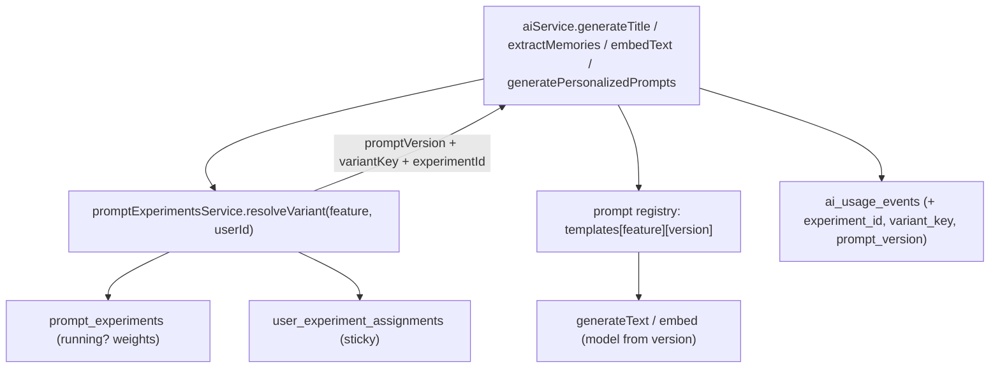

# Prompt Versioning and A/B Testing (Approach C - Hybrid)

Prompts live in code as versioned templates; experiment definitions and per-user assignments live in Postgres; results are attributed via new columns on `ai_usage_events`. When no experiment is running, every feature falls back to a registry-defined control version, so behavior is unchanged.

## Architecture

Resolution: `resolveVariant` finds the single `running` experiment for a feature; if found, it reads (or deterministically creates + persists) a sticky weighted assignment keyed on `userId + experimentId`; if none, it returns the registry's control version with `experimentId = null`.

## 1. In-code prompt registry

New folder `apps/api/src/lib/ai/prompts/` with one file per feature (`title.prompts.ts`, `memory-extraction.prompts.ts`, `personalized-prompts.prompts.ts`, `embedding.prompts.ts`) plus a `registry.ts` barrel. Each file exports a typed map of `version -> { model, build(params): string }` (embeddings version selects model/preprocessing rather than a text prompt) and names a `CONTROL_VERSION`.

Move the existing inline strings from [apps/api/src/lib/ai/ai.service.ts](apps/api/src/lib/ai/ai.service.ts) verbatim as the `v1` / control of each feature (e.g. the title prompt at line 371, extraction prompt at lines 438-451, personalized prompt at lines 549-561). Seed one alternative version (`v2`) per feature as the first experiment treatment.

## 2. Experiment + assignment persistence

New feature module `apps/api/src/features/prompt-experiments/` (table, service, routes, `index.ts`, exported from [apps/api/src/lib/db/schema.ts](apps/api/src/lib/db/schema.ts)).

- `prompt_experiments`: `id`, `feature` (reuse `aiUsageFeatureEnum`), `name`, `status` enum `draft|running|completed`, `variants` jsonb (`[{ key, promptVersion, weight }]`), `createdAt`/`updatedAt`. Partial unique index so only one `running` experiment per feature.
- `user_experiment_assignments`: `id`, `experimentId` (fk), `userId` (fk `app_users.id`), `variantKey`, `promptVersion`, `assignedAt`; unique on `(experimentId, userId)`.
- `prompt-experiments.service.ts`: `resolveVariant({ feature, userId })`, `assignVariant` (weighted deterministic hash of `userId+experimentId`, persisted via `onConflictDoNothing` then re-read for stickiness), plus admin CRUD (`createExperiment`, `setStatus`, `listExperiments`, `getResults`).

## 3. Telemetry columns

Add nullable `experiment_id` (uuid), `variant_key` (text), `prompt_version` (text) to `ai_usage_events` in [apps/api/src/features/observability/observability.table.ts](apps/api/src/features/observability/observability.table.ts) (+ index on `experiment_id`). `recordAiUsage` already spreads the event object, so only the callers need to pass the new fields.

## 4. Wire ai.service.ts

In each of the four methods in [apps/api/src/lib/ai/ai.service.ts](apps/api/src/lib/ai/ai.service.ts): call `resolveVariant` first, build the prompt from the registry by resolved version (use the version's `model`), and include `experimentId`/`variantKey`/`promptVersion` in every `recordAiUsage` call (success, error, and fallback paths — fallbacks record the resolved version with `status: 'fallback'`). The dev script `generate-entries.ts` is out of scope for v1.

## 5. Personalized-prompts cache key

Add `prompt_version` to `entry_prompts` in [apps/api/src/features/prompts/prompts.table.ts](apps/api/src/features/prompts/prompts.table.ts), include it in the unique index `(entryId, focusCategory, promptVersion, sortOrder)`, and filter `listStoredPrompts` / conflict targets / insert values in [apps/api/src/features/prompts/prompts.service.ts](apps/api/src/features/prompts/prompts.service.ts) by the resolved version so a version change produces a cache miss and regeneration. `generatePersonalizedPrompts` returns the resolved `promptVersion` to the prompts service for storage.

## 6. Admin surface

Add experiment CRUD + a results query (group `ai_usage_events` by `experiment_id`, `variant_key`: counts, status breakdown, avg latency, avg tokens) to the existing internal observability area, reusing `InternalAccessMiddleware` (admin-gated in prod). Extend `observability.service.ts` with the grouped query.

## 7. Migrations

From `apps/api`: `pnpm db:generate` then `pnpm db:migrate` (CLAUDE.md flow). One generated migration covers the new tables + `ai_usage_events` columns + `entry_prompts` column/index change. Commit `.sql`, snapshot, and `_journal.json` together.

## 8. Tests (vitest, co-located)

- `prompt-experiments.service.test.ts`: weighted-hash determinism, assignment stickiness, single-running-per-feature, control fallback when none running.
- `prompts/registry` test: each version's `build()` output (snapshot) and presence of control versions.
- Extend [apps/api/src/lib/ai/ai.service.test.ts](apps/api/src/lib/ai/ai.service.test.ts): mock `resolveVariant` + `generateText`/`embed`, assert correct prompt string and that variant metadata reaches `recordAiUsage`.
- Extend `prompts.service.test.ts`: cache identity includes `promptVersion`.

## Verification

`cd apps/api && pnpm type-check && pnpm test:run`, then a manual smoke test creating a 50/50 experiment for `personalized_prompts` and confirming sticky assignment + variant rows in `ai_usage_events`.
