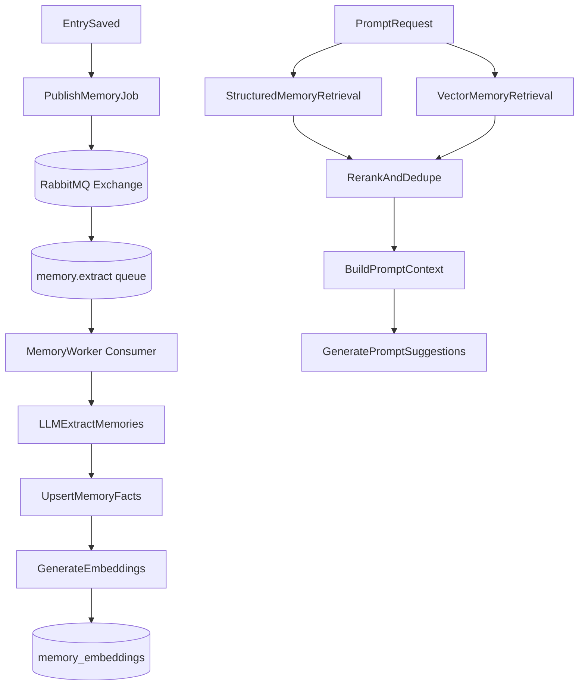

# Hybrid User Memory Plan

## Goals

- Keep the product north star explicit: help developers make measurable progress toward their goals.
- Persist long-lived, categorized memories (goals, projects, preferences, blockers, wins, habits) with progress signals.
- Update memories asynchronously via RabbitMQ after entry changes so editor/save UX stays fast.
- Retrieve memory with both structured ranking and semantic relevance for prompt generation.
- Keep memory auditable, versioned, and user-scoped.
- Make this feature brag-doc ready (without implementing brag doc in this phase).

## Product Guardrails for This Feature

- Optimize extraction and ranking for developer outcomes: shipped work, impact, learning, ownership, collaboration, and momentum toward stated goals.
- Prioritize memories that answer: "What am I building?", "Why does it matter?", "How am I progressing?", and "What is blocked?"
- Avoid overfitting to generic life journaling; keep taxonomy developer-centric while still allowing `other`.
- Store enough structured evidence to support future brag-doc generation from the same memory substrate.
- Memory lifecycle default: soft decay for ranking, then auto-archive (no hard delete).

## Memory Lifecycle Defaults (Agreed)

- Use soft decay: memories lose retrieval weight over time when not reinforced by new evidence.
- Start decay after 30 days without supporting entry evidence.
- Auto-archive after 120 days without reinforcement (still retained for history/audit).
- Decay weights are category-sensitive:
  - `win` and impact-oriented memories decay slower.
  - transient `blocker` memories decay faster once unresolved activity disappears.
- Archived memories are excluded from default prompt retrieval but remain queryable in history/manage UI.

## Current Baseline (What We Leverage)

- Onboarding profile data is currently flat on `[/Users/codyepstein/repos/june-bugv2/apps/api/src/features/app-users/app-users.table.ts](/Users/codyepstein/repos/june-bugv2/apps/api/src/features/app-users/app-users.table.ts)`.
- Entry writes happen through `[/Users/codyepstein/repos/june-bugv2/apps/api/src/features/entries/entries.routes.ts](/Users/codyepstein/repos/june-bugv2/apps/api/src/features/entries/entries.routes.ts)` and `[/Users/codyepstein/repos/june-bugv2/apps/api/src/features/entries/entries.service.ts](/Users/codyepstein/repos/june-bugv2/apps/api/src/features/entries/entries.service.ts)`.
- AI integration exists in `[/Users/codyepstein/repos/june-bugv2/apps/api/src/lib/ai/ai.service.ts](/Users/codyepstein/repos/june-bugv2/apps/api/src/lib/ai/ai.service.ts)` and can be extended for extraction + prompt generation.
- Prompt UI is static today in `[/Users/codyepstein/repos/june-bugv2/apps/web/src/components/sidebar/PromptsSidebar.tsx](/Users/codyepstein/repos/june-bugv2/apps/web/src/components/sidebar/PromptsSidebar.tsx)`.

## Proposed Architecture

## RabbitMQ Queue Design (V1)

- Use RabbitMQ as the async transport for memory extraction jobs (not DB polling).
- Publish entry-change events from API to a durable exchange (e.g. `memory.events`) with routing key `entry.changed`.
- Bind a durable queue `memory.extract` for worker consumption.
- Configure dead-lettering:
  - main queue: `memory.extract`
  - dead-letter queue: `memory.extract.dlq`
  - park permanently failed messages in DLQ after max retries.
- Consumer behavior:
  - ack only after successful memory upsert + embedding updates.
  - nack/requeue on transient failures with bounded retry/backoff strategy.
  - nack without requeue (or route to DLQ) on non-retriable validation failures.
- Job payload should stay minimal and versioned:
  - `{ jobVersion, jobId, userId, entryId, entryUpdatedAt }`.
- Enforce idempotency in worker logic:
  - de-dupe using a deterministic key like `memory-process:{entryId}:{entryUpdatedAt}`.
  - safe to process at-least-once deliveries without duplicate memory rows.

## Data Model (V1)

Create a new backend feature module `memories` in `apps/api/src/features/memories/` with:

- `user_memories` table:
  - `id`, `user_id`, `category`, `title`, `summary`, `evidence_entry_id`, `confidence`, `importance`, `first_seen_at`, `last_seen_at`, `status(active|stale|archived)`, `source(onboarding|entry|system)`, timestamps.
  - Add progress-friendly fields: `goal_id` (nullable), `project_name`, `impact_type`, `impact_summary`, `milestone_state(planned|in_progress|completed|blocked)`.
- `memory_categories` enum (or constrained text):
  - `goal`, `project`, `milestone`, `blocker`, `win`, `learning`, `skill_growth`, `preference`, `habit`, `relationship`, `value`, `other`.
- `memory_embeddings` table:
  - `memory_id`, `embedding vector`, `embedding_model`, `updated_at`.
- Optional `memory_events` table for audit trail:
  - `memory_id`, `event_type(created|updated|merged|archived)`, `payload`, `created_at`.
- Optional `achievement_evidence` table (future-facing for brag docs, read-only in V1):
  - `memory_id`, `entry_id`, `evidence_quote`, `evidence_type(shipped|ownership|leadership|learning|collaboration|quality|customer_impact)`, `created_at`.

Also add onboarding-to-memory bootstrapping:

- Map existing onboarding fields (`developmentGoals`, `currentRole`, `techStack`, etc.) into initial memories with `source='onboarding'`.

## Async Pipeline (V1)

1. After entry create/update, API publishes a RabbitMQ message (non-blocking from save path).
2. `memory.extract` consumer receives message and validates payload version/idempotency key.
3. Worker fetches recent entry text + top existing memories.
4. LLM extraction returns structured candidates:

- `{ category, fact, confidence, evidence_span, operation(create|update|archive_hint) }`.

1. Apply merge rules:

- Match by semantic similarity + normalized keys; update `last_seen_at` and confidence.
- Avoid duplicates via canonicalization (`project:xyz`, `goal:ship-mobile-v1`).

1. Generate/update embeddings for changed memory rows.
2. Ack message only after all writes succeed; otherwise retry or dead-letter according to policy.

## Retrieval + Prompt Generation

Add API endpoints under `memories.routes.ts`:

- `GET /api/memories` (filter by category/status).
- `POST /api/memories/refresh` (admin/dev trigger for reprocessing).
- `POST /api/prompts/personalized`:
  - Inputs: optional `focusCategory`, optional `entryDraft`.
  - Retrieval strategy:
    - Structured: recency + importance + confidence + category match + goal/project momentum + freshness decay score.
    - Semantic: vector search against memory summaries with query from focus or latest entries.
  - Return: 3-5 prompts + why each prompt was chosen (lightweight rationale metadata), with at least one prompt anchored to active goals/projects.

## Backend Integration Points

- Extend `[/Users/codyepstein/repos/june-bugv2/apps/api/src/lib/ai/ai.service.ts](/Users/codyepstein/repos/june-bugv2/apps/api/src/lib/ai/ai.service.ts)` with:
  - `extractMemoriesFromEntry(...)`
  - `generatePersonalizedPrompts(...)`
- Add memory service + routes in a new feature folder and export from schema barrel:
  - `[/Users/codyepstein/repos/june-bugv2/apps/api/src/lib/db/schema.ts](/Users/codyepstein/repos/june-bugv2/apps/api/src/lib/db/schema.ts)`.
- Add RabbitMQ publisher in entry create/update flow:
  - `[/Users/codyepstein/repos/june-bugv2/apps/api/src/features/entries/entries.service.ts](/Users/codyepstein/repos/june-bugv2/apps/api/src/features/entries/entries.service.ts)`.
- Add a memory worker consumer process (same repo, separate startup target) that subscribes to `memory.extract`.
- Add RabbitMQ connection/channel management module under `apps/api/src/lib/queue/` (or similar), shared by publisher and consumer.

## Frontend Integration (After API is Stable)

- Replace static prompt list in `[/Users/codyepstein/repos/june-bugv2/apps/web/src/components/sidebar/PromptsSidebar.tsx](/Users/codyepstein/repos/june-bugv2/apps/web/src/components/sidebar/PromptsSidebar.tsx)` with API-backed personalized prompts.
- Add lightweight memory management UI later (read-only first, editable in V2).

## Quality, Safety, and Rollout

- Add guardrails:
  - Never store raw sensitive PII unless explicitly allowed.
  - Cap extracted memory length and reject low-confidence facts.
- Add tests:
  - Memory merge/dedupe logic.
  - Category classification validation.
  - Prompt retrieval relevance regression tests.
  - Publisher/consumer contract tests (message schema + routing key).
  - Retry + dead-letter behavior tests for transient vs non-retriable failures.
- Rollout in phases:
  1. schema + RabbitMQ plumbing (exchange/queue/DLQ) + extraction consumer + internal endpoint,
  2. entry-save publisher integration + observability (queue depth, retry count, DLQ count),
  3. personalized prompt endpoint,
  4. frontend sidebar integration,
  5. memory editing/audit UX.
