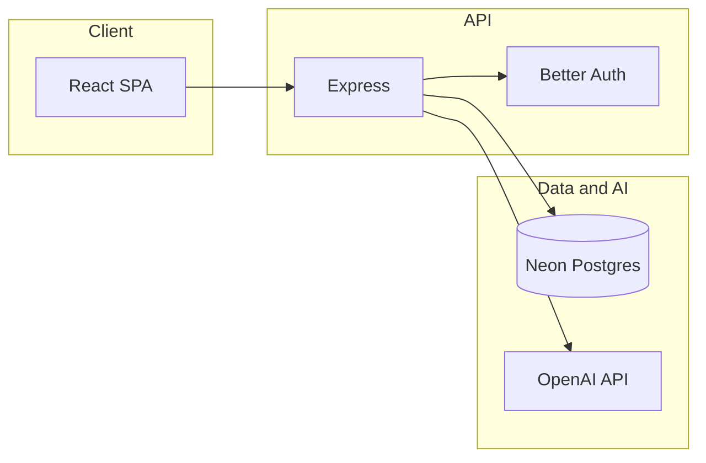

# JuneBug

JuneBug is a full-stack journaling app aimed at developers. It gives you one entry per calendar day, a rich text editor, and AI-assisted features: automatic titles, extraction of long-lived “memories” from what you write, and personalized writing prompts grounded in those memories.

This repository is a ground-up rewrite of an earlier Convex-based version. The stack is Express, Postgres, Drizzle, and Better Auth.

## What it does

**Journaling.** Each user has at most one entry per calendar date. Entries are stored as structured editor JSON (Tiptap) plus plain text for search. You can search across entries, browse by recency, and use tags (including system-assisted tags).

**AI titles.** After enough content is written, the backend can generate a short title for the entry using OpenAI (GPT-4o-mini).

**Memories and prompts.** A pipeline processes entry text to maintain structured memories (e.g. goals, projects, wins, blockers, learnings) with embeddings and audit events. Those memories feed **personalized journaling prompts** in the UI (by focus area: what you’re working on, wins, bugs, lessons). When AI is unavailable, the app falls back to heuristics and template prompts.

**Other product features.** Todos, an onboarding questionnaire (profile and preferences stored on the app user record), and optional GitHub sign-in alongside email/password.

**Operations.** An internal dashboard (admin-only in the UI) surfaces AI usage and queue job telemetry for debugging and cost awareness.

## Architecture

The repo is a **pnpm workspace** monorepo: `apps/web` (React SPA), `apps/api` (Express API), and `packages/shared` (shared TypeScript types).

The API is organized **by feature**: each domain lives under `apps/api/src/features/<name>/` with table definitions (Drizzle), services, and routes where applicable. Authenticated routes resolve an application user record linked to Better Auth’s user id.



Entry changes trigger memory extraction inline in the API process (fire-and-forget with retries). Optional integrations (S3-style uploads, Resend email) are wired at the environment level where present.

## Tech stack

| Layer | Choices |
|--------|---------|
| Frontend | React 19, Vite, TypeScript, Tailwind CSS v4, Shadcn UI, Tiptap, TanStack React Query, Zustand, React Router |
| Backend | Express, TypeScript, Drizzle ORM, Zod |
| Database | Neon Postgres (serverless driver) |
| Auth | Better Auth (email/password, GitHub OAuth) |
| AI | Vercel AI SDK + OpenAI (titles, memory extraction, prompt suggestions) |
| Testing | Vitest, Testing Library |

## Getting started

**Prerequisites:** Node.js 20+ (LTS), pnpm 9+, and a [Neon](https://neon.tech) (or compatible) Postgres database.

1. Install dependencies from the repo root:

   ```bash
   pnpm install
   ```

2. Create `apps/api/.env` with at least:

   - `DATABASE_URL` — Postgres connection string  
   - `BETTER_AUTH_SECRET` — at least 32 characters (e.g. `openssl rand -hex 32`)

   Optional variables cover GitHub OAuth, AI keys (see `apps/api/src/lib/ai/` gateway + feature AI in `CLAUDE.md`), S3 uploads, and email. Core journaling works without optional services; AI-heavy features need the corresponding keys.

3. Apply the schema to your database (development):

   ```bash
   cd apps/api && pnpm db:push
   ```

4. Start the app from the repo root:

   ```bash
   pnpm dev
   ```

   This runs the API (default port **3000**) and the web app (default port **5174**).

## Project structure

```
june-bugv2/
├── apps/
│   ├── api/          # Express backend, Drizzle schema, scripts
│   └── web/          # React + Vite frontend
├── packages/
│   └── shared/       # Shared types
├── package.json
└── pnpm-workspace.yaml
```

## Scripts (root)

| Command | Description |
|---------|-------------|
| `pnpm dev` | Run API and web dev servers in parallel |
| `pnpm build` | Build all packages |
| `pnpm test` | Run tests in all workspaces |
| `pnpm lint` | Lint all packages |
| `pnpm type-check` | Typecheck all packages |

For database tooling (`db:generate`, `db:migrate`, `db:push`, `db:studio`) and API-only tests, see `apps/api/package.json`. For frontend tests, see `apps/web/package.json`.

## License

MIT
